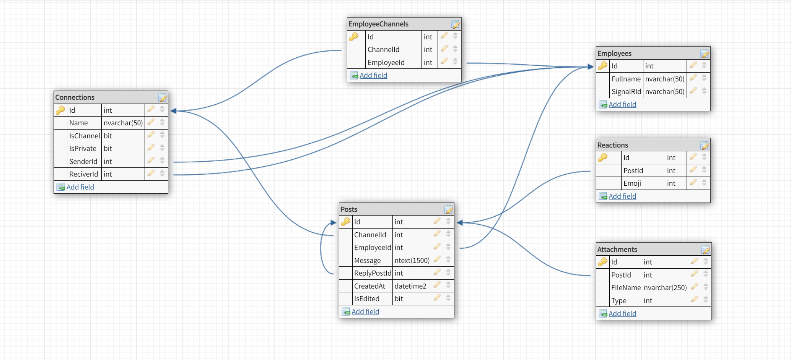

## PYP Pre Assignment For Backend

---

#### Tapşırıq

Lahiyə mesajlaşma sistemin backend tərəfinin yazılması.

### Entities

### Əməliyyatlar

### Auth

- Register - qeydiyyat edilə bilinməlidir. Bu zaman təsdiq email getməlidir. Təsdiqsiz istifadəçi login etdiyi halda xeta mesajı göstərməlidir.
- Login - email və şifrəsi ilə daxil ola bilməlidir.
- Forget Password - email düzgün olduğu halda, Epoçt göndərməli və ordan şifrəsini dəyişə bilməlidir.
- Change Password - Köhnə şifrəsini və yeni şifrəsini daxil edib şifrəsini dəyişə bilər [Authorize - JWT Token]

### Actions [Authorize - JWT Token]

- Create Connection
- Update Connection
- Delete Connection
- Add User to Connection
- Get Channel List by User
- Get Direct Messages List by User

### Messaging [Authorize - JWT Token]

- Get Posts by Connection Id(Reactions count, Replies Count)
- Get Replies by Post Id(Reactions count)
- Create Post
- Update Post
- Delete Post
- Crete Reply
- Update Reply
- Delete Reply
- Download Attactment

### Realtime [Authorize - JWT Token]

- Create Post In Channel - All Channel Users without Sender
- Create Post in Directly Message - Not Sender
- Create Reply In Channel - Post Owner and all replier
- Create Reply in Directly Message - Not Sender

##### Testing

Lahiyənin Unit Testingi yazılmalıdır və Code Coverage 80%-den yuxarı olmalıdır.

#### Logging

- Sistemdə bütün xətalar loglanmalıdır.

---

#### Texnologiyalar

- Backend : .NET
- UI: SwaggerUI
- Database: SQL Server
- Git: GitHub
- Email Client: SendGrid
- Socket: SignalR

---

#### Təhvil və bitiş vaxtı

- Lahiyə 04.12.2022-yə qədər yekunlaşmalıdır.
- Lahiyə source code olaraq GitHub-da şəxsi profilinizdə private repo-da olmalıdır. Hər kəs repo-ya Yolçu və Cavid müəllimi collaborator kimi əlavə etməlidir
